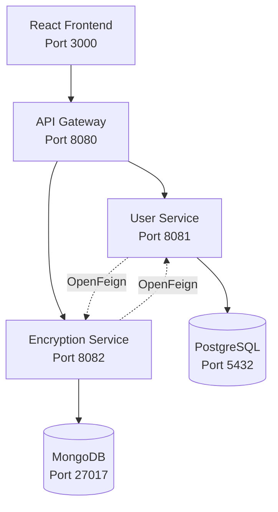

# 🔐 Microservices Encryption Tool

A full-stack application demonstrating microservices architecture with Spring Boot backend and React frontend. This project implements a simple encryption and decryption tool with user management, showcasing modern development practices and inter-service communication.

## 📋 Table of Contents
- [Features](#features)
- [Architecture](#architecture)
- [Technology Stack](#technology-stack)
- [Prerequisites](#prerequisites)
- [Project Structure](#project-structure)
- [Installation & Setup](#installation--setup)
- [API Documentation](#api-documentation)
- [Usage Examples](#usage-examples)
- [Microservices Communication](#microservices-communication)
- [Database Schema](#database-schema)
- [Frontend Interface](#frontend-interface)
- [Troubleshooting](#troubleshooting)
- [Contributing](#contributing)
- [License](#license)

## ✨ Features

### Backend Features
- **Microservices Architecture** with service isolation
- **API Gateway** for centralized routing and CORS handling
- **Multiple Database Support** (PostgreSQL + MongoDB)
- **Inter-service Communication** using OpenFeign clients
- **Encryption Algorithms** (AES, Base64 encoding)
- **User Management** with PostgreSQL persistence
- **Encryption History** tracking with MongoDB
- **Global Exception Handling** with proper error responses
- **Health Check Endpoints** for monitoring
- **Logging** and error tracking

### Frontend Features
- **Modern React** application with hooks
- **Tailwind CSS** for responsive styling
- **Real-time Encryption/Decryption** interface
- **User Management** with CRUD operations
- **Encryption History** visualization
- **Multi-algorithm Support** selection
- **Responsive Design** for all devices

## 🏗️ Architecture



### Service Responsibilities
- **API Gateway**: Request routing, CORS handling, centralized entry point
- **User Service**: User CRUD operations, PostgreSQL integration, user validation
- **Encryption Service**: Text encryption/decryption, MongoDB storage, algorithm management

## 🛠️ Technology Stack

### Backend
| Component | Technology | Version |
|-----------|------------|---------|
| Framework | Spring Boot | 3.x |
| Gateway | Spring Cloud Gateway | Latest |
| Database | PostgreSQL | 15+ |
| NoSQL | MongoDB | 7+ |
| ORM | Spring Data JPA | Latest |
| HTTP Client | OpenFeign | Latest |
| Code Generation | Lombok | Latest |
| Build Tool | Maven | 3.8+ |

### Frontend
| Component | Technology | Version |
|-----------|------------|---------|
| Framework | React | 18+ |
| Styling | Tailwind CSS | 3.x |
| Icons | Lucide React | Latest |
| Build Tool | Create React App | Latest |

### Infrastructure
| Component | Technology | Version |
|-----------|------------|---------|
| Containerization | Docker | 20+ |
| Orchestration | Docker Compose | 2+ |
| Java | OpenJDK | 17+ |
| Node.js | Node.js | 18+ |

## 📋 Prerequisites

Before running this application, ensure you have:

- **Java 17+** installed
- **Node.js 18+** installed
- **Maven 3.8+** for building Spring Boot applications
- **Docker & Docker Compose** for database setup
- **IDE** (IntelliJ IDEA, VS Code, or Eclipse)
- **Git** for version control

### Verify Prerequisites
```bash
java --version
node --version
npm --version
mvn --version
docker --version
docker-compose --version
```

## 📁 Project Structure

```
encryption-microservices/
├── 📁 api-gateway/                 # Spring Cloud Gateway
│   ├── src/main/java/com/example/apigateway/
│   ├── src/main/resources/
│   │   └── application.yml
│   └── pom.xml
├── 📁 user-service/                # User Management Service
│   ├── src/main/java/com/example/userservice/
│   │   ├── controller/
│   │   ├── service/
│   │   ├── entity/
│   │   ├── repository/
│   │   ├── dto/
│   │   ├── client/
│   │   └── exception/
│   ├── src/main/resources/
│   │   └── application.yml
│   └── pom.xml
├── 📁 encryption-service/          # Encryption Service
│   ├── src/main/java/com/example/encryptionservice/
│   │   ├── controller/
│   │   ├── service/
│   │   ├── entity/
│   │   ├── repository/
│   │   ├── dto/
│   │   ├── client/
│   │   └── exception/
│   ├── src/main/resources/
│   │   └── application.yml
│   └── pom.xml
├── 📁 frontend/                    # React Frontend
│   ├── public/
│   ├── src/
│   │   ├── components/
│   │   ├── App.js
│   │   ├── index.css
│   │   └── index.js
│   ├── package.json
│   └── tailwind.config.js
├── docker-compose.yml              # Database setup
└── README.md                       # This file
```

## 🚀 Installation & Setup

### 1. Clone Repository
```bash
git clone https://github.com/your-username/encryption-microservices.git
cd encryption-microservices
```

### 2. Database Setup
```bash
# Start PostgreSQL and MongoDB
docker-compose up -d

# Verify containers are running
docker ps
```

### 3. Backend Services Setup

#### API Gateway (Port 8080)
```bash
mkdir api-gateway && cd api-gateway

# Initialize with Spring Boot dependencies:
# spring-cloud-starter-gateway, spring-boot-starter-actuator
```

Create project using [Spring Initializr](https://start.spring.io/) with these dependencies:
```
spring-cloud-starter-gateway,spring-boot-starter-actuator
```

```bash
# Add configuration and run
mvn spring-boot:run
```

#### User Service (Port 8081)
```bash
mkdir user-service && cd user-service

# Initialize with dependencies:
# spring-boot-starter-web, spring-boot-starter-data-jpa, postgresql, lombok, spring-cloud-starter-openfeign, spring-boot-starter-actuator
```

Create project with dependencies:
```
spring-boot-starter-web,spring-boot-starter-data-jpa,postgresql,lombok,spring-cloud-starter-openfeign,spring-boot-starter-actuator
```

```bash
# Add all User Service code and run
mvn spring-boot:run
```

#### Encryption Service (Port 8082)
```bash
mkdir encryption-service && cd encryption-service

# Initialize with dependencies:
# spring-boot-starter-web, spring-boot-starter-data-mongodb, lombok, spring-cloud-starter-openfeign, spring-boot-starter-actuator
```

Create project with dependencies:
```
spring-boot-starter-web,spring-boot-starter-data-mongodb,lombok,spring-cloud-starter-openfeign,spring-boot-starter-actuator
```

```bash
# Add all Encryption Service code and run
mvn spring-boot:run
```

### 4. Frontend Setup
```bash
mkdir frontend && cd frontend

# Create React app
npx create-react-app . --template typescript

# Install Tailwind CSS
npm install -D tailwindcss postcss autoprefixer
npx tailwindcss init -p

# Configure Tailwind (see detailed config in setup guide)
# Add the React component code
npm start
```

### 5. Startup Sequence
1. **Databases** (Docker): `docker-compose up -d`
2. **API Gateway**: `mvn spring-boot:run` (Port 8080)
3. **User Service**: `mvn spring-boot:run` (Port 8081)
4. **Encryption Service**: `mvn spring-boot:run` (Port 8082)
5. **Frontend**: `npm start` (Port 3000)

## 📚 API Documentation

### User Service Endpoints

| Method | Endpoint | Description |
|--------|----------|-------------|
| POST | `/api/users` | Create new user |
| GET | `/api/users` | Get all users |
| GET | `/api/users/{id}` | Get user by ID |
| GET | `/api/users/username/{username}` | Get user by username |
| GET | `/api/users/{id}/with-history` | Get user with encryption history |
| DELETE | `/api/users/{id}` | Delete user |

### Encryption Service Endpoints

| Method | Endpoint | Description |
|--------|----------|-------------|
| POST | `/api/encryption/encrypt` | Encrypt text |
| POST | `/api/encryption/decrypt` | Decrypt text |
| GET | `/api/encryption/user/{userId}/history` | Get user encryption history |

### Request/Response Examples

#### Create User
```bash
POST /api/users
Content-Type: application/json

{
    "username": "john_doe",
    "email": "john@example.com"
}

# Response
{
    "id": 1,
    "username": "john_doe",
    "email": "john@example.com",
    "createdAt": "2024-01-15T10:30:00"
}
```

#### Encrypt Text
```bash
POST /api/encryption/encrypt
Content-Type: application/json

{
    "userId": 1,
    "text": "Hello World",
    "algorithm": "AES"
}

# Response
{
    "id": "507f1f77bcf86cd799439011",
    "userId": 1,
    "originalText": "Hello World",
    "encryptedText": "U2FsdGVkX1+vupppZksvRf5pq5g5XjFRlipRkwB0K1Y=",
    "algorithm": "AES",
    "createdAt": "2024-01-15T10:35:00"
}
```

#### Decrypt Text
```bash
POST /api/encryption/decrypt
Content-Type: application/json

{
    "encryptedText": "U2FsdGVkX1+vupppZksvRf5pq5g5XjFRlipRkwB0K1Y=",
    "algorithm": "AES"
}

# Response
{
    "decryptedText": "Hello World",
    "algorithm": "AES"
}
```

## 🔗 Microservices Communication

### OpenFeign Clients

**Encryption Service → User Service**
```java
@FeignClient(name = "user-service", url = "http://localhost:8081")
public interface UserServiceClient {
    @GetMapping("/users/{id}")
    UserDto getUserById(@PathVariable Long id);
}
```

**User Service → Encryption Service**
```java
@FeignClient(name = "encryption-service", url = "http://localhost:8082")
public interface EncryptionServiceClient {
    @GetMapping("/user/{userId}/history")
    List<EncryptionResponseDto> getUserEncryptionHistory(@PathVariable Long userId);
}
```

### Communication Flow
1. **Client Request** → API Gateway
2. **Gateway** → Routes to appropriate service
3. **Inter-service calls** via OpenFeign when needed
4. **Response** flows back through the same path

## 🗄️ Database Schema

### PostgreSQL (User Service)
```sql
CREATE TABLE users (
    id BIGSERIAL PRIMARY KEY,
    username VARCHAR(255) UNIQUE NOT NULL,
    email VARCHAR(255) NOT NULL,
    created_at TIMESTAMP DEFAULT CURRENT_TIMESTAMP
);
```

### MongoDB (Encryption Service)
```javascript
// Collection: encryption_records
{
    "_id": ObjectId,
    "userId": Long,
    "originalText": String,
    "encryptedText": String,
    "algorithm": String,
    "createdAt": ISODate
}
```

## 🖥️ Frontend Interface

### Main Features
- **User Selection Panel**: Create and select users
- **Encryption/Decryption Panel**: Process text with different algorithms
- **History Panel**: View past encryption operations
- **Status Panel**: Monitor microservices health

### Supported Algorithms
- **AES Encryption**: Secure symmetric encryption
- **Base64 Encoding**: Simple text encoding

## 🐛 Troubleshooting

### Common Issues

#### Port Conflicts
```bash
# Check if ports are in use
netstat -an | grep -E ":(8080|8081|8082|3000|5432|27017)"

# Kill processes using specific ports
kill -9 $(lsof -ti:8080)
```

#### Database Connection Issues
```bash
# Check Docker containers
docker ps
docker logs postgres-db
docker logs mongo-db

# Restart databases
docker-compose down && docker-compose up -d
```

#### Service Communication Issues
```bash
# Check service health
curl http://localhost:8080/actuator/health
curl http://localhost:8081/actuator/health  
curl http://localhost:8082/actuator/health

# Check logs for Feign client errors
tail -f logs/application.log
```

### Health Checks
```bash
# API Gateway Health
curl -X GET http://localhost:8080/actuator/health

# User Service Health
curl -X GET http://localhost:8081/actuator/health

# Encryption Service Health  
curl -X GET http://localhost:8082/actuator/health

# Frontend Access
curl -X GET http://localhost:3000
```

### Debug Mode
Add to `application.yml` for detailed logging:
```yaml
logging:
  level:
    com.example: DEBUG
    org.springframework.cloud.openfeign: DEBUG
```

## 🧪 Testing

### Manual Testing Flow
1. **Start all services** following the setup sequence
2. **Access frontend** at `http://localhost:3000`
3. **Create users** using the interface
4. **Select a user** and try encryption
5. **View history** for the selected user
6. **Test decryption** with the encrypted text

### API Testing with curl
```bash
# Test complete flow
./test-scripts/test-flow.sh
```

## 🚀 Deployment

### Docker Deployment (Future Enhancement)
```bash
# Build all services
docker-compose -f docker-compose.prod.yml build

# Deploy complete stack
docker-compose -f docker-compose.prod.yml up -d
```

### Environment Configurations
- **Development**: `application-dev.yml`
- **Testing**: `application-test.yml`
- **Production**: `application-prod.yml`

## 📈 Performance Considerations

- **Connection Pooling**: Configured for database connections
- **Caching**: Redis can be added for frequently accessed data
- **Load Balancing**: Multiple service instances can be deployed
- **Circuit Breaker**: Can be added to Feign clients for resilience

## 🔒 Security

### Current Implementation
- **CORS Configuration**: Handled by API Gateway
- **Input Validation**: Basic validation in DTOs
- **Error Handling**: No sensitive information in error responses

### Production Recommendations
- Add Spring Security for authentication
- Implement JWT tokens for authorization  
- Use proper encryption key management
- Add rate limiting and request validation
- Implement audit logging

## 🤝 Contributing

1. Fork the repository
2. Create a feature branch (`git checkout -b feature/amazing-feature`)
3. Commit your changes (`git commit -m 'Add amazing feature'`)
4. Push to the branch (`git push origin feature/amazing-feature`)
5. Open a Pull Request

### Code Style
- Follow Spring Boot best practices
- Use Lombok for reducing boilerplate
- Implement proper exception handling
- Add meaningful comments for complex logic

## 📄 License

This project is licensed under the MIT License - see the [LICENSE](LICENSE) file for details.

## 🙋‍♂️ Support

If you have any questions or run into issues:

1. Check the [Troubleshooting](#troubleshooting) section
2. Review the [Issues](https://github.com/your-username/encryption-microservices/issues) page
3. Create a new issue with detailed information
4. Contact the maintainers

## 🎯 Learning Objectives

This project demonstrates:
- ✅ Microservices architecture patterns
- ✅ Inter-service communication with OpenFeign
- ✅ Polyglot persistence (PostgreSQL + MongoDB)
- ✅ API Gateway implementation
- ✅ Modern React development
- ✅ Docker containerization
- ✅ RESTful API design
- ✅ Error handling strategies
- ✅ Logging and monitoring

---

**Built with ❤️ for learning microservices architecture**